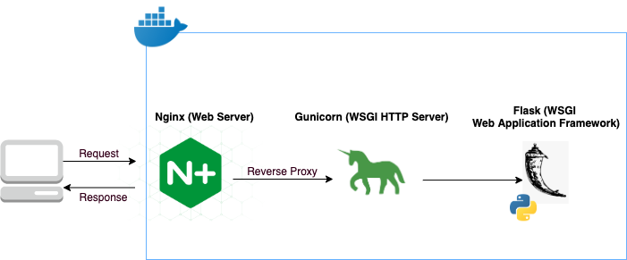

## This project allows user to track availability of beds in the US

### System Architecture
This is docker image with Python3, Gunicorn and Nginx managed by Supervisor


### Tools Used
```
Docker: Lightweight virtual machine
Apline Linux: Minimal operating system 
Nginx: Reverse Proxy
Flask: Lightweight web application framework
Gunicorn: HTTP Server for the flask app
Supervisor: Allows us to run nginx and gunicorn simultaneously
```

### Running the application locally
```
docker build . --tag where-are-the-beds-backend --build-arg AWS_ACCESS_KEY_ID= --build-arg AWS_SECRET_ACCESS_KEY=
docker run --rm -it -p80:80 where-are-the-beds-backend
```
Once the backend is up, open another terminal and run `curl localhost/beds`

### Debugging 
```
docker exec -it <container-id> /bin/sh
Alpine only have sh unlike ubuntu which runs in /bin/bash 
```