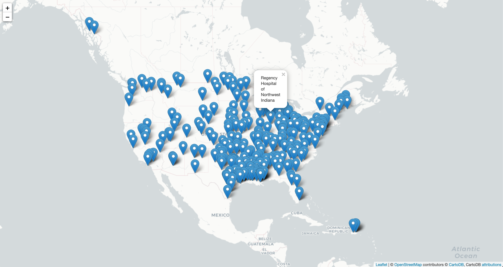
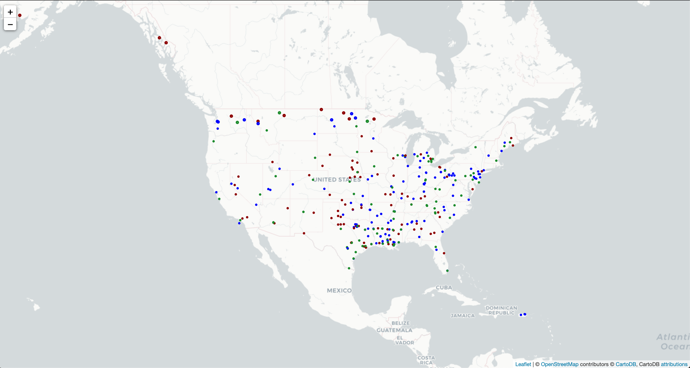

## This project allows user to track availability of beds in the US

### Views:
View all available beds


View beds utilization rate


### Technologies Used
```
Docker: Lightweight virtual machine
Flask: Lightweight web application framework
```

### Running the application locally
```
docker build . --tag where-are-the-beds-backend
docker run --rm -it -e AWS_ACCESS_KEY_ID=<access_key_id> -e AWS_SECRET_ACCESS_KEY=<secret_access_key> -p80:80 where-are-the-beds-backend
```
Once the backend is up, open another terminal and run `curl -i localhost/~`

### Debugging 
```
docker exec -it <container-id> /bin/sh
Alpine only have sh unlike ubuntu which runs in /bin/bash 
```